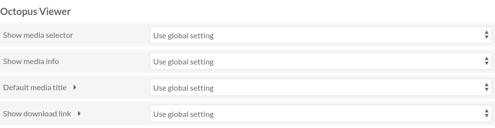

Configuration
=============

Settings can be found in two places.

* The module configuration page contains :ref:`global settings <global-settings>`
* The site configuration page contains :ref:`site settings <site-settings>`

.. _global-settings:

Global settings
---------------

Global settings can be found in the module configuration page.

#. Log in to the administration interface
#. In the navigation menu on the left, click on the "Modules" link (under "ADMIN" section)
#. Find Octopus Viewer in the list
#. Click on the corresponding "Configure" button

.. image:: images/global-settings.png

Show viewer on the item page
~~~~~~~~~~~~~~~~~~~~~~~~~~~~

.. note::
   This setting is mostly for Omeka S 3.2 and will likely be removed in the future.

   For Omeka S 4.x you should let this setting at its default value ("No") and
   use `resource page blocks
   <https://omeka.org/s/docs/user-manual/sites/site_theme/#configure-resource-pages>`_
   instead.

This setting allow you to choose where the viewer will be placed on the item
page.

Possible values:

No
    Do not show the viewer. This can be useful if the theme is already
    displaying the viewer.

Before the item content
    Display the viewer before (above) the item content

After the item content
    Display the viewer after (below) the item content

IIIF Image URI template
~~~~~~~~~~~~~~~~~~~~~~~

See :doc:`iiif-image-servers`

Show media selector
~~~~~~~~~~~~~~~~~~~

This setting controls whether the media selector (the left panel) is shown or
not.  This global setting can be overriden in :ref:`site settings
<site-settings>`.

Possible values:

Only if there are several media
    The media selector will be displayed only there is more than one media to
    show. This is the default value.

Always
    Always show the media selector, even if there is only one media.

Never
    Never show the media selector.

Show media info
~~~~~~~~~~~~~~~

This setting controls whether the media info (the right panel) is shown or
not.  This global setting can be overriden in :ref:`site settings
<site-settings>`.

Possible values:

Always
    Always show the media info.

Never
    Never show the media info.

Default media title
~~~~~~~~~~~~~~~~~~~

This setting controls what is displayed in the media selector, next to the
media thumbnail, if the media does not have a title. This global setting can be
overriden in :ref:`site settings <site-settings>`.

Possible values:

[Untitled]
    Display the text "[Untitled]". This is the default behaviour.

No text
    Display no text. Only the thumbnail will be visible.

Show download link
~~~~~~~~~~~~~~~~~~

This setting controls whether a download link is shown or not next to the media
title. This global setting can be overriden in :ref:`site settings <site-settings>`.

Possible values:

No
    Do not show a download link. This is the default behaviour.

Yes
    Show a download link.

.. note::
   This does not work for media types where the original file is not stored in
   Omeka (Youtube videos for instance)

.. _site-settings:

Site settings
-------------

Site settings can be found in the `site settings page
<https://omeka.org/s/docs/user-manual/sites/site_settings/#settings>`_.

In this page there is a section called "Octopus Viewer".

Show media selector
~~~~~~~~~~~~~~~~~~~

This setting controls whether the media selector (the left panel) is shown or
not. This setting overrides the global setting.

Possible values:

Use global setting
    Use the value defined in the :ref:`global settings <global-settings>`. This
    is the default value.

Only if there are several media
    The media selector will be displayed only there is more than one media to
    show.

Always
    Always show the media selector, even if there is only one media.

Never
    Never show the media selector.

Show media info
~~~~~~~~~~~~~~~

This setting controls whether the media info (the right panel) is shown or
not. This setting overrides the global setting.

Possible values:

Use global setting
    Use the value defined in the :ref:`global settings <global-settings>`. This
    is the default value.

Always
    Always show the media info.

Never
    Never show the media info.

Default media title
~~~~~~~~~~~~~~~~~~~

This setting controls what is displayed in the media selector, next to the
media thumbnail, if the media does not have a title. This setting overrides the
global setting.

Possible values:

Use global setting
    Use the value defined in the :ref:`global settings <global-settings>`. This
    is the default value.

[Untitled]
    Display the text "[Untitled]".

No text
    Display no text. Only the thumbnail will be visible.

Show download link
~~~~~~~~~~~~~~~~~~

This setting controls whether a download link is shown or not next to the media
title. This setting overrides the global setting.

Possible values:

Use global setting
    Use the value defined in the :ref:`global settings <global-settings>`. This
    is the default value.

No
    Do not show a download link. This is the default behaviour.

Yes
    Show a download link.

.. note::
   This does not work for media types where the original file is not stored in
   Omeka (Youtube videos for instance)
